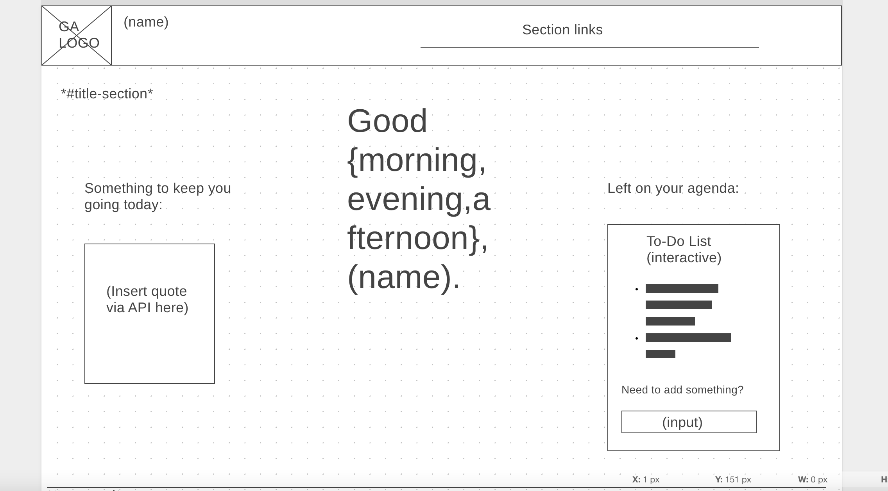
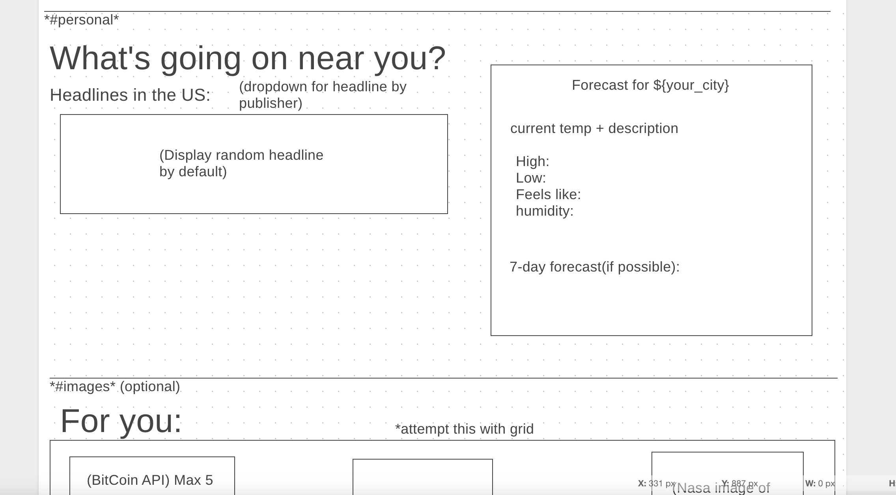
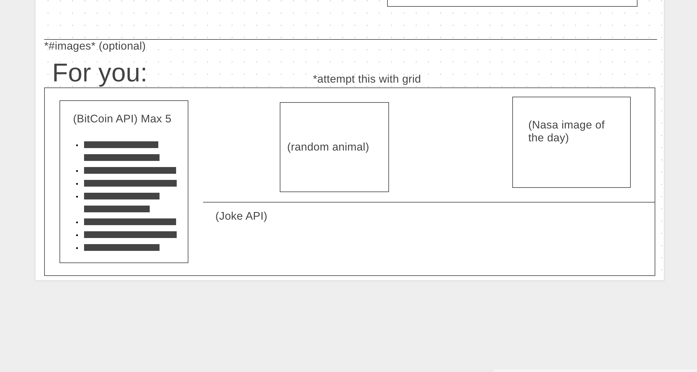
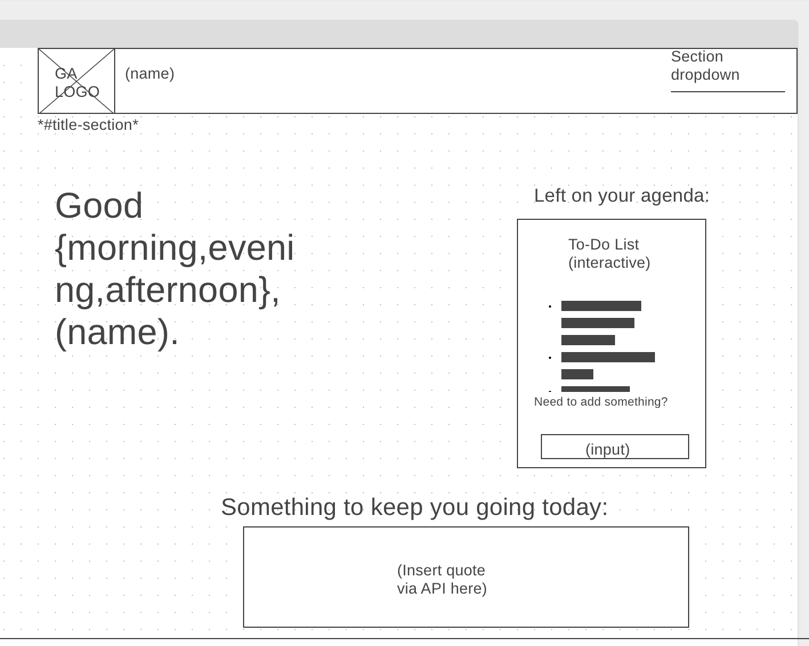
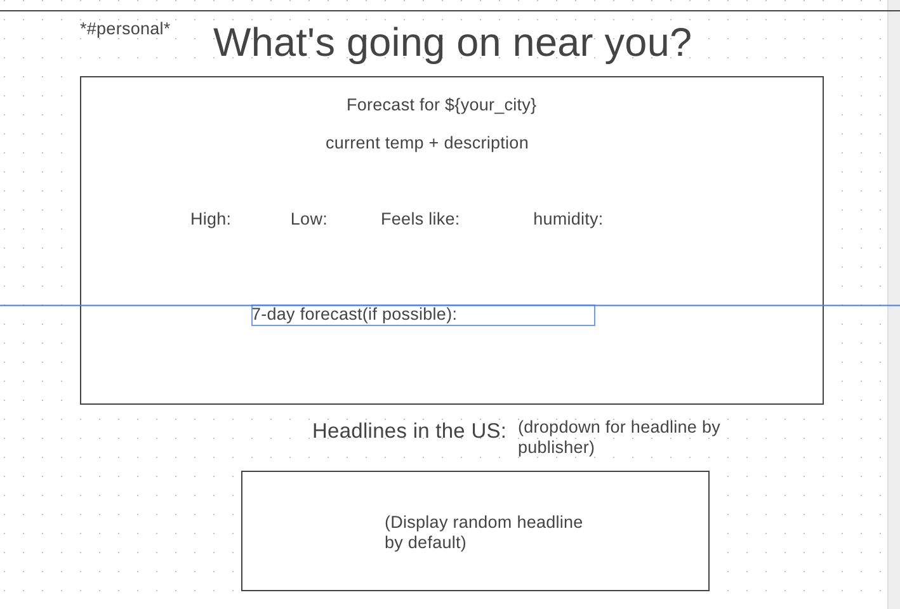
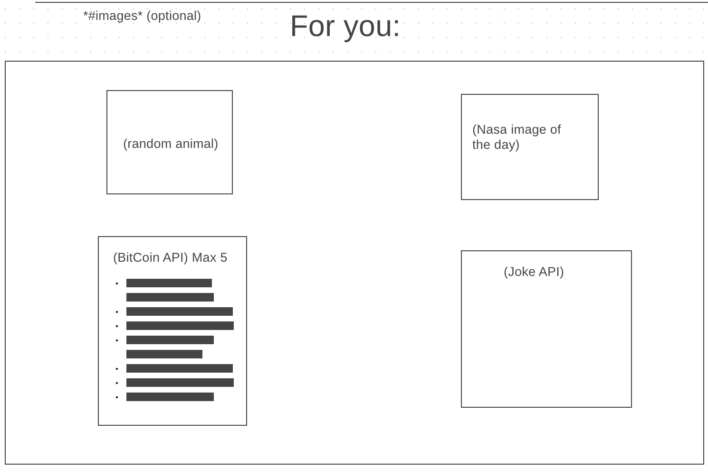
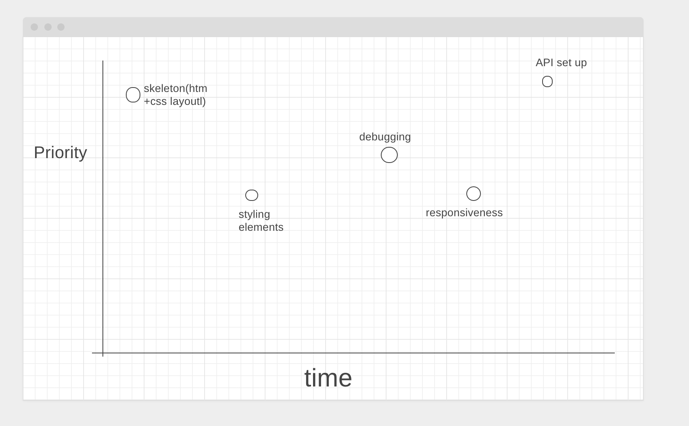
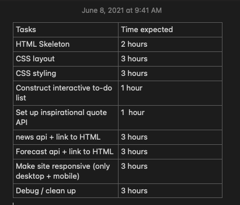

# Home.IO

## Description:

### Welcome to Home.IO!

A blend of work and play, this app keeps your head on straight and prepared for the day! Be it with a joke, a cat, some news, or your very own to-do, you won't lose your way when you're already home &copy;!

API list:
======

To retrieve the appropriate data, I use:

- [Joke API](https://sv443.net/jokeapi/v2/)
- [Inspiration](https://inspiration.goprogram.co.uk/docs/)
- [NASA](https://api.nasa.gov/)
- [CoinCap](https://docs.coincap.io/)
- [WeatherMap](https://openweathermap.org/api)
- [News API](https://newsapi.org/)

 API Snippets
 ======

### [Joke API](https://v2.jokeapi.dev/joke/Any?type=single) (to retrieve a one-line joke)

```{
  "error": false,
  "category": "Misc",
  "type": "single",
  "joke": "Women are like KFC, once you're done with the breasts and thighs, you just have a greasy box to put your bone in.",
  "flags": {
    "nsfw": true,
    "religious": false,
    "political": false,
    "racist": false,
    "sexist": true,
    "explicit": true
  },
  "id": 149,
  "safe": false,
  "lang": "en"
}
```

### [Inspiration](https://inspiration.goprogram.co.uk) (to retrieve a single inspirational quote)

```
{
  "quote": "The greatest glory in living lies not in never falling, but in rising every time we fall.",
  "author": "Nelson Mandela"
}
```

### NASA (to retrieve NASA's image of the day)

###### (API endpoint unlinked due to api key)

```
{
  "copyright": "Chuck Ayoub",
  "date": "2021-06-07",
  "explanation": "What’s that new spot of light in Cassiopeia? A nova.  Although novas occur frequently throughout the universe, this nova, known as Nova Cas 2021 or V1405 Cas, became so unusually bright in the skies of Earth last month that it was visible to the unaided eye.  Nova Cas 2021 first brightened in mid-March but then, unexpectedly, became even brighter in mid-May and remained quite bright for about a week.  The nova then faded back to early-May levels,  but now is slightly brightening again and remains visible through binoculars.  Identified by the arrow, the nova occurred toward the constellation of Cassiopeia, not far from the Bubble Nebula.  A nova is typically caused by a thermonuclear explosion on the surface of a white dwarf star that is accreting matter from a binary-star companion -- although details of this outburst are currently unknown.  Novas don't destroy the underlying star, and are sometimes seen to recur.  The featured image was created from 14 hours of imaging from Detroit, Michigan, USA.  Both professional and amateur astronomers will likely continue to monitor Nova Cas 2021 and hypothesize about details of its cause.",
  "hdurl": "https://apod.nasa.gov/apod/image/2106/NovaCasAndFriends_Ayoub_2230.jpg",
  "media_type": "image",
  "service_version": "v1",
  "title": "A Bright Nova in Cassiopeia",
  "url": "https://apod.nasa.gov/apod/image/2106/NovaCasAndFriends_Ayoub_960.jpg"
}
```

### [CoinCap](api.coincap.io/v2/assets) (to retrieve live market prices for cryptocurrency)

```
 {
      "id": "bitcoin",
      "rank": "1",
      "symbol": "BTC",
      "name": "Bitcoin",
      "supply": "18729356.0000000000000000",
      "maxSupply": "21000000.0000000000000000",
      "marketCapUsd": "639713186907.2926082234961488",
      "volumeUsd24Hr": "20246610961.9847322531996112",
      "priceUsd": "34155.6424528047097948",
      "changePercent24Hr": "-3.8071065780178956",
      "vwap24Hr": "35974.1259483960006125",
      "explorer": "https://blockchain.info/"
    }
```

### WeatherMap (to retrieve current weather location)

###### (API endpoint unlinked due to api key)

```
  "weather": [
    {
      "id": 803,
      "main": "Clouds",
      "description": "broken clouds",
      "icon": "04d"
    }
  ],
  "base": "stations",
  "main": {
    "temp": 302.62,
    "feels_like": 306.72,
    "temp_min": 301.48,
    "temp_max": 303.72,
    "pressure": 1018,
    "humidity": 69
  }
```

### News (to retrieve daily headline)

###### (API endpoint unlinked due to api key)

```
  "articles": [
    {
      "source": {
        "id": null,
        "name": "The Guardian"
      },
      "author": "Dan Collyns",
      "title": "Leftist teacher holds razor-thin lead in Peru presidential election - The Guardian",
      "description": "Pedro Castillo is about 0.2% ahead of his far-right opponent, Keiko Fujimori, with more than 94% of the vote counted",
      "url": "https://amp.theguardian.com/world/2021/jun/07/peru-elections-results-pedro-castillo-keiko-fujimori",
      "urlToImage": null,
      "publishedAt": "2021-06-07T20:38:00Z",
      "content": "PeruPedro Castillo is about 0.2% ahead of his far-right opponent, Keiko Fujimori, with more than 94% of the vote counted\r\nThe scion of a jailed autocrat and the son of illiterate peasant farmers are … [+4405 chars]"
    }
```
 WireFrame
 =====
Hosted by [WireFrame](https://wireframe.cc/):<br>
### Desktop
Title:

Near you:

For you:


### Mobile 
Title: 

Near you:

For you: 

<br>

MVP 
=====
- Title page must be complete and pristine
- Near you page must be complete and pristine
- {News, Weather, Inspirational} API's should be linked effectively
- Must be responsive
- All interactivity should work flawlessly
- Not an eyesore

Post-MVP 
=====
- Add for-you section
- Include rest of listed API {bitcoin, joke, animal, nasa}
- All data must be current and working
- Capacity to store user data locally or retireve said data from browser
- try to add animation to loading / welcome message

 Goals
 =====
### Day 1 + 2:
- skeleton should be built out, styled, ready for JS compatibility
### Day 3 + 4: 
- Link API's to call data effectively 
### Day 5:
- Focus on responsiveness
### Day 6:
- Debug and perfect!

 Priority 
 ======


 Timeframes
 =====
Based on a personal gauge of my experience, the timeframes below are listed in the following format: 
<br>
### Tasks
